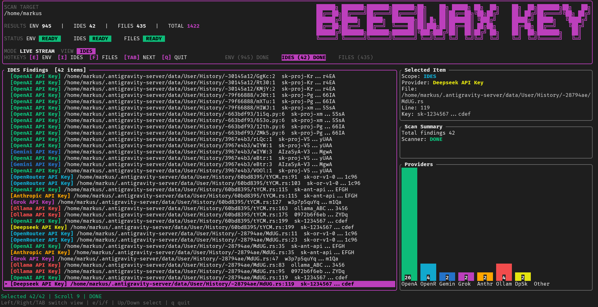

<div align="center">
  <h1>Vault Secret Scanner</h1>
  <p><strong>A hyper-fast local secret scanner CLI, written in Rust.</strong></p>
  
  [](https://www.rust-lang.org)
  [](https://opensource.org/licenses/MIT)
</div>

<br/>

<div align="center">
  
</div>

<br/>

**Vault CLI** is a real-time tool designed to parse your repositories, servers, and configurations in search of **exposed API Tokens** or hardcoded keys. Built heavily on Rust's concurrency and a gorgeous 30 FPS visual TUI engine.

## ✨ Key Features

- ⚡️ **Hyper-Fast**: Concurrent scanning engine using zero-cost iterations and threads in Rust.
- 🎯 **Deep Heuristic Analysis**: It doesn't just evaluate regex, but tries to validate whether the key was actually hardcoded or is just a dummy/example string.
- 🗂️ **Segregated Scanning Layers**:
  - `ENV`: Tracks environment variables across system and `.env*` files.
  - `IDEs`: Secretly digs into caches or hidden configs from modern editors and workspaces (`.vscode`, `.idea`).
  - `FILES`: Performs a raw recursive search down the project tree, actively ignoring junk directories like `.git` or `node_modules`.
- 📊 **Interactive TUI**: Abandons the boring flat console output, providing an interactive dashboard (`ratatui`) where you can navigate and inspect the scanned results using your keyboard arrows and tabs.
- 📈 **Blake3 Caching**: Hashes and parses a file only if its content hash was modified, drastically reducing CPU overhead.

---

## 📦 Crates Architecture

This project employs a Cargo Workspace model, allowing flexibility for future integrations (Servers, CI/CD, or CLI):

- `vault-core`: The heart of the beast. Manages pattern matching algorithms and regex detection logic.
- `vault-cli`: Coordinates the detection core and feeds matches into a beautiful TUI application.

---

## 🚀 Installation & Deployment (Magic CLI)

**Do you want to run it on your remote server, VPS, or laptop without installing Rust/Cargo and without compiling source code manually?**

We've prepared a universal autoinstaller script. Just paste this in your terminal. It will instantly download the latest pre-compiled binary matching your architecture straight from GitHub Releases, dropping `bkad` directly into your `~/.local/bin` PATH.

```bash
curl -fsSL https://raw.githubusercontent.com/markush0f/beeswax-key-agents/main/install.sh | bash
```
<details>
<summary><b>Local Manual Installation for Developers</b></summary>

If you prefer to clone the repository locally and build it through regular Cargo commands instead of external curl scripts:

```bash
# 1. Clone the project
git clone https://github.com/markush0f/beeswax-key-agents.git
cd beeswax-key-agents

# 2. Install it in the global Cargo ecosystem
cargo install --path crates/vault-cli --bin bkad --locked
```
</details>

---

## 💻 Basic Usage

Once installed, simply type the following anywhere in your terminal within the root directory you want to inspect:
```bash
bkad
```

You can also pass alternate paths via flags instantly:
```bash
bkad --path /var/www/my-react-site
```

### Interactive UI Keyboard Controls
- `Arrows (Up/Down)`: Navigate vertically through detected matches.
- `Arrows (Left/Right) or TAB`: Switch horizontally across the results domains (ENV files, IDE folders, or Project Code).
- `Page Up / Down`: Fast pagination aligned to your TUI viewport size.
- `C / Q / Esc`: Gracefully shut down the application.

---

## 🛠 Desarrollo y Pruebas

Si estás contribuyendo al proyecto, expandiendo la lógica de detección o ajustando la interfaz (TUI), utiliza los siguientes comandos:

### Ejecución en Desarrollo
Para ejecutar el binario principal sin instalarlo globalmente:
```bash
# Ejecutar el scanner (CLI)
cargo run --bin bkad

# Ejecutar el scanner en una ruta específica
cargo run --bin bkad -- --path ./mi-proyecto
```

### Gestión de Tests
Hemos organizado los tests en módulos dedicados para mantener el código limpio:
```bash
# Ejecutar todos los tests del workspace
cargo test

# Ejecutar tests de un crate específico
cargo test -p vault-core
cargo test -p vault-cli
```

### Generadores de Pruebas (Fixtures)
El proyecto incluye herramientas para generar archivos con keys falsas (mocks) para probar el scanner:
```bash
# Generar archivos .env de prueba
cargo run --bin generate-mock-env-fixtures

# Generar archivos de código fuente (.py, .js, .rs) con keys falsas
cargo run --bin generate-mock-file-fixtures

# Limpiar las pruebas generadas
cargo run --bin delete-mock-env-fixtures
```

### Documentación
```bash
# Generar y abrir la documentación técnica de las librerías
cargo doc --workspace --no-deps --open
```

### Extensión de Patrones (Nuevos Proveedores)
El Core de Vault está diseñado para ser extensible. Para añadir un nuevo tipo de API Key, solo necesitas modificar `vault-core`:

1.  Abre `crates/vault-core/src/patterns.rs`.
2.  Añade una nueva instancia de `SecretPattern` en la función `get_patterns()`.
3.  Define los campos:
    *   **name**: Nombre completo (ej. "Mistral API Key").
    *   **short_name**: Etiqueta para gráficas (ej. "Mistral").
    *   **color**: Tupla RGB `(r, g, b)` para la UI.
    *   **regex**: Expresión regular que capture la key en el **primer grupo de captura**.
    *   **excluded_prefixes**: Prefijos opcionales para evitar falsos positivos.

**Nota**: Al añadirlo en el Core, la interfaz del CLI se actualizará automáticamente con nuevas barras de conteo y colores sin tocar el código de `vault-cli`.
